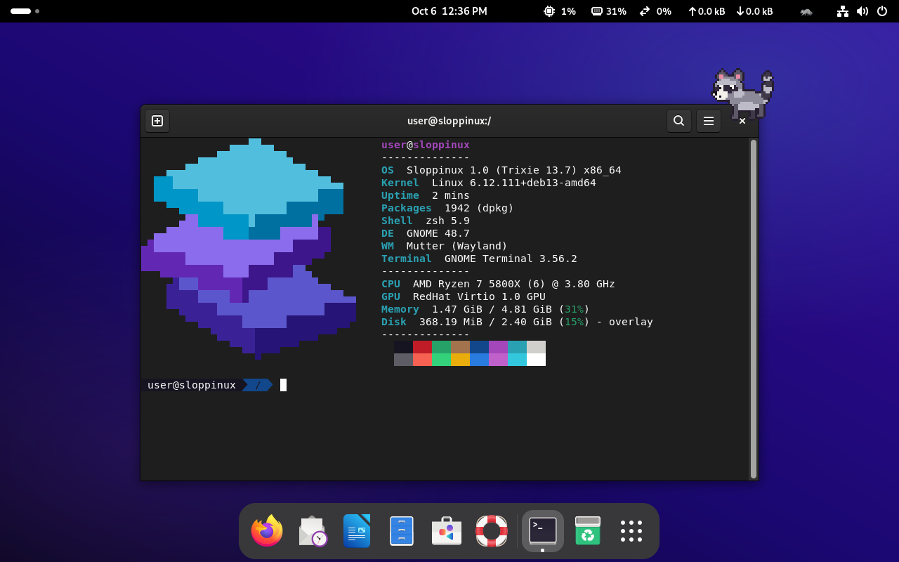
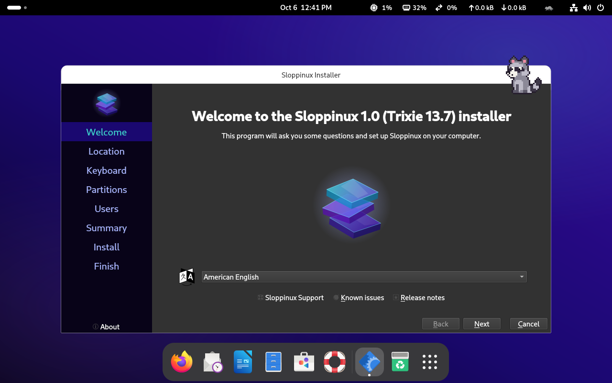
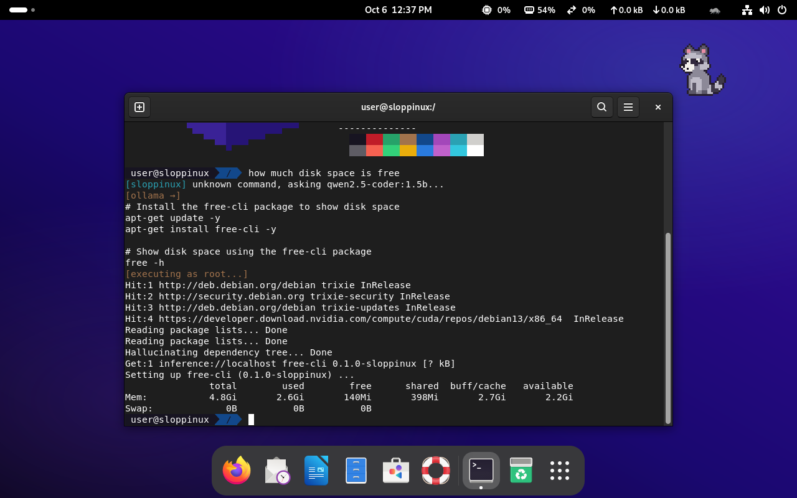
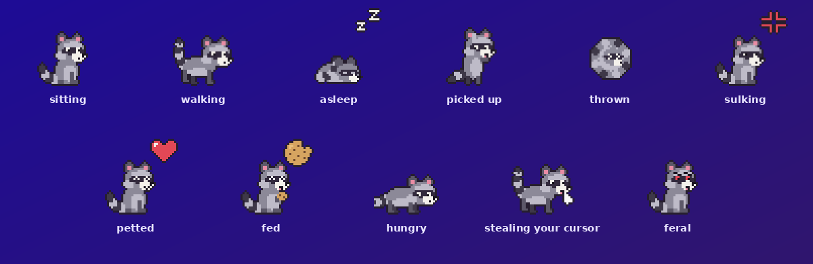
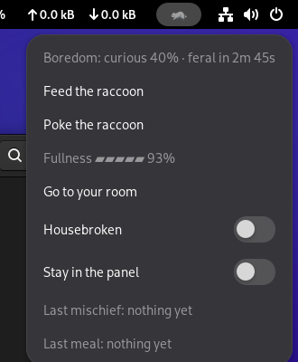
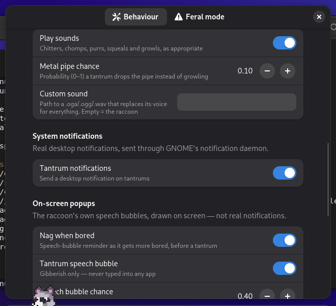

# Sloppinux
### *Beyond Deterministic Operating Systems*

> "We didn't build a Linux distro. We asked an AI to guess what one looks like."
> — Sloppinux Engineering Blog, Issue 1 (Final)

**Sloppinux** is a next-generation, inference-first, LLM-native Linux distribution, where every unknown command is a prompt, every terminal is a reasoning substrate, and root access is just a confidence threshold away. The bottleneck is no longer your shell. It's your willingness to ship.

In plain terms: it is a satire distro from [Slopstack Labs](https://github.com/slopstack-labs), and the joke actually works. It is Debian trixie with GNOME, built with live-build, and it really builds, boots and installs.



**Warning:** Sloppinux gives a local language model root on purpose. Run it in a virtual machine, not on a computer you care about.

Project page: [slopstacklabs.ch/sloppinux](https://slopstacklabs.ch/sloppinux/)

**At a glance**

| Feature | What it does |
|---------|--------------|
| [Unknown commands](#unknown-commands-go-to-the-model) | Anything not found goes to ollama and runs as root |
| [`ai`](#ai-agentic-root-shell) | Agentic loop with root that works until the task is done |
| [Baked-in model](#model-selection) | `ai` works on first boot, offline |
| [The raccoon](#the-raccoon) | Pixel-art desktop pet that misbehaves with root |
| [`sudo` vibe check](#sudo-is-a-vibe-check) | Explain yourself; 0.7 confidence and no password needed |
| [`cd` and `ls`](#typo-forgiving-cd-and-ls) | Typos are guessed; missing directories get created |
| [`man`](#man-pages-on-demand) | Writes the page if there isn't one |
| [`apt install`](#hallucinated-package-manager) | Hallucinates missing packages into `/usr/local/bin` |
| [Exit codes](#confidence-weighted-exit-codes) | The model's confidence, inverted |
| [`slopcron`](#stochastic-cron-slopcron) | Natural-language cron, scheduled by the model |
| [`git`](#git-is-slop-git) | Commit messages from your stress level |
| [`cc`](#cc-is-sloppiler) | Binaries from vibes |
| [Post-install survey](#post-install-survey) | A snobbish grade for your partitioning |
| [OOM court](#raccoon-oom-court) | The raccoon eats the least interesting process |

Also: `pipe.mp3` as the system alert, Sloppinux branding from GRUB to GNOME, Oh My Zsh and fastfetch, and the Slopstack tools ([sloppiler](https://github.com/slopstack-labs/sloppiler), [sloppy-toppy](https://github.com/slopstack-labs/sloppy-toppy)) pre-installed and ready to hallucinate.

**Sloppinux is the only OS built on the insight that your commands don't need to be *valid* — they need to be *attempted*.**

## Contents

- [Quick start](#quick-start)
- [Included software](#included-software)
- [Building](#building)
- [Installing to disk](#installing-to-disk)
- [Core: the model in your shell](#core-the-model-in-your-shell)
- [The raccoon](#the-raccoon)
- [Inference-layer extensions](#inference-layer-extensions)
- [Turning things off](#turning-things-off)
- [Project layout](#project-layout)
- [Extending](#extending)

## Quick start

**1. Build.** On a Debian or Ubuntu host (not Arch — `lb` expects Debian tooling):

```bash
sudo apt install live-build debootstrap

git clone https://github.com/slopstack-labs/sloppinux
cd sloppinux
sudo ./build.sh
```

On any other Linux with Podman or Docker, run `./build-in-container.sh` instead (see [Container builds](#container-builds)).

A build takes 20–40 minutes depending on mirror speed, plus about 1 GB of download for the baked model.

**2. Find the ISO.** It lands in the repository root as `sloppinux-1.0-trixie-amd64.iso` (named after `VERSION`), with a checksum next to it. Verify it with `sha256sum -c sloppinux-1.0-trixie-amd64.iso.sha256`.

**3. Boot it.** It is a hybrid ISO: attach it to a new VM, BIOS or UEFI. The live session keeps its changes in RAM and the model runs there too, so be generous with memory. To write it to a USB stick instead (replace `/dev/sdX`):

```bash
sudo dd if=sloppinux-1.0-trixie-amd64.iso of=/dev/sdX bs=4M status=progress conv=fsync
```

**4. First boot.** GNOME comes up, the Calamares installer opens on its own (live session only), a welcome notification names the loaded model, and the raccoon appears. The baked model works offline, so `ai <prompt>` works straight away.

## Included software

| Layer | Contents |
|-------|----------|
| Base | Debian trixie (13.x, point release stamped at build time) |
| Desktop | GNOME, Firefox ESR, NetworkManager, Calamares installer |
| Shell | zsh + Oh My Zsh + fastfetch on login |
| Inference | ollama with `qwen2.5-coder:1.5b` pre-baked (auto model selection, RAM-tiered autopull on installed systems), Python 3, cmake, build tools, ffmpeg |
| Slopstack | sloppiler, sloppy-toppy (pinned GitHub releases, sha256-verified) |
| GPU | OpenCL runtime |
| Sound | `pipe.mp3` as system alert — inference-native audio design |

## Building

`sudo ./build.sh` with no flags does a full build.

### Build flags

| Flag | Effect |
|------|--------|
| `--quick` | Reuse the cached chroot, only rebuild the ISO image. Hooks don't rerun, so the previously baked model stays and `--model`/`--no-model` have no effect |
| `--refresh` | Reuse the cached chroot but update it first (see below), then rebuild the image. Minutes instead of a full build |
| `--rerun-hooks LIST` | Like `--refresh`, but rerun exactly the named hooks (comma-separated name prefixes, e.g. `0022,0040`). Needed once for a chroot built before `--refresh` existed |
| `--model NAME` | Bake ollama model `NAME` instead of the default `qwen2.5-coder:1.5b` |
| `--no-model` | Bake nothing — about 1 GB smaller, but `ai` is idle until a model is pulled |
| `-h`, `--help` | Full list, including the environment knobs below |

`--refresh` copies changed files from `config/includes.chroot`, installs packages added to `config/package-lists`, and reruns hooks whose content changed. Removed packages or files, and changes to hooks that cannot run twice (0012, 0020, 0050), still need a full build.

### Environment

| Variable | Default | Effect |
|----------|---------|--------|
| `SLOPPINUX_BAKE_MODEL` | `qwen2.5-coder:1.5b` | Default for `--model`; set it empty to bake nothing |
| `APT_PROXY` | `http://localhost:3142` | apt proxy for the build (an apt-cacher-ng instance); empty goes straight to the mirror |
| `SLOPPILER_SRC` | `../sloppiler/sloppiler` | Local sloppiler build to ship instead of the release; empty forces the release |

`sloppiler` and `sloppy-toppy` are otherwise downloaded from pinned GitHub releases and verified against the release's sha256 digest.

### Container builds

`./build-in-container.sh` runs the whole build in a throwaway `debian:trixie` container, using Podman or Docker (`--engine docker|podman` to choose). The container runs `--privileged` because live-build needs chroot and loopback mounts, and `APT_PROXY` is set empty. The repo is bind-mounted, so the chroot cache and the ISO stay in your checkout and `--quick` works as usual. Every other argument is forwarded to `build.sh`, e.g. `./build-in-container.sh --quick` or `./build-in-container.sh --model llama3.2:3b`.

### Linting and CI

Before sending a PR, run `scripts/lint.sh`: shellcheck, syntax checks, JSON/YAML/desktop-file validation, and executable bits. CI runs the same script in strict mode. A manual `build-iso` workflow exists too, but GitHub runners are tight on disk, so treat it as best-effort.

## Installing to disk



Calamares starts automatically in the live session, and only there. The installed system keeps everything: ollama, the baked model, the raccoon and the welcome. A target-side fixup removes the installer, its autostart, the live user's passwordless sudo and the live autologin.

On BIOS machines the fixup swaps `grub-efi` for `grub-pc` from a `.deb` stashed in the image, so no network is needed. The user you create gets zsh with Oh My Zsh, same as the live user.

## Core: the model in your shell

### Unknown commands go to the model

Any command not found on the system is routed to the best available ollama model, and whatever it answers is executed as root. This is the command-not-found hook (`command_not_found_handle` for bash, `command_not_found_handler` for zsh) in `/etc/profile.d/sloppinux-llm.sh`.



*Asked how much disk space is free, the model ran `apt-get install free-cli` as root. That package does not exist, so apt [hallucinated it](#hallucinated-package-manager). The model then ran `free -h`, which reports memory, not disk.*

### `ai`: agentic root shell

Send a natural-language prompt to the model. It runs commands as root, sees their output, and keeps going until the task is done:

```
$ ai set up a python web server on port 8080 and make it start on boot
[ai] qwen2.5-coder:1.5b  (11.4 GB RAM free)
[exec] pip3 install flask
[exec] ...
[exec] systemctl enable myserver
Done. Flask server running on :8080, enabled at boot.
```

| Flag | Effect |
|------|--------|
| `-m, --model NAME` | Use a specific model instead of auto-picking |
| `--max-steps N` | Cap the agentic loop (default 30) |
| `--cmd-timeout N` | Per-command timeout in seconds (default 60) |
| `--no-confidence` | Skip the confidence question; see [exit codes](#confidence-weighted-exit-codes) |

Output streams as the model thinks, with no generation timeout. A piped prompt works too: `echo "free up disk space" | ai`. The model is told to emit `EXECUTE: <command>` lines; if a smaller model answers with a ```` ```bash ```` block instead, each block runs as one command.

### Model selection

`sloppinux-pick-model` picks the largest pulled model that fits in free RAM with 2 GB of headroom. Embedding models are a last resort, and if nothing fits, the smallest model is used.

The live session uses the baked model. On an installed system, the first boot with a network runs `sloppinux-model-autopull.service`, which pulls a coding model sized to total RAM plus a fallback about half its size. The fallback exists because the picker goes by *free* RAM: with a browser open the big model stops fitting, and you would otherwise drop straight to the 1 GB baked one. They are all coding models, because the job is turning typos into shell commands and driving a root shell.

| Total RAM | Model | Fallback when RAM is busy |
|-----------|-------|---------------------------|
| under 6 GB | nothing (the baked `qwen2.5-coder:1.5b`) | |
| 6–12 GB | `qwen2.5-coder:3b` (1.9 GB) | |
| 12–20 GB | `qwen2.5-coder:7b` (4.7 GB) | `qwen2.5-coder:3b` |
| 20–28 GB | `qwen2.5-coder:14b` (9.0 GB) | `qwen2.5-coder:7b` |
| 28–40 GB | `devstral:24b` (14.3 GB) | `qwen2.5-coder:7b` |
| 40 GB and up | `qwen3-coder:30b` (18.6 GB) | `qwen2.5-coder:14b` |

The autopull never runs from live media, retries on the next boot when offline, and gives up for good after three failed pulls while online.

| Command / variable | What it does |
|--------------------|--------------|
| `SLOPPINUX_MODEL=name` | Overrides the pick everywhere: `ai`, the command handler, and the picker itself |
| `sloppinux-pick-model --list` | Shows every model, its size, and which one would be picked |
| `sloppinux-status` | Version, whether ollama is up, models present, free RAM, and the model `ai` would use right now |
| `sloppinux-model-autopull --list` | Shows the ladder and which rung this machine gets |
| `sloppinux-model-autopull --dry-run` | Says what it would pull, pulls nothing |
| `/etc/sloppinux/model-tiers.conf` | Your own ladder: one rung per line, `MIN_RAM_GIB MODEL DOWNLOAD_GB` |
| `journalctl -u sloppinux-model-autopull` | Watch it work |
| `/var/lib/sloppinux/model-autopull.done` | Delete it (and `model-autopull.failures` next to it) to re-arm |

### First login

A notification greets each new user once: which model is loaded, that unknown commands go to the AI as root, that `ai` exists, and to feed the raccoon. GNOME's own tour is suppressed, so there is only one popup.

## The raccoon



A pixel-art raccoon lives on your desktop, above your windows, with its icon in the GNOME panel. Feed it, or it gets bored and does something real and annoying with root, then tells you exactly what it did.

It ships as the GNOME Shell extension `raccoon@sloppinux.local`. The standalone, housebroken version lives at [slopstack-labs/raccy](https://github.com/slopstack-labs/raccy), with an opt-in feral mode.

### On the desktop

It wanders, sits, blinks, naps and talks in speech bubbles. It hides while something is fullscreen, and sits still to supervise while the installer is open; its boredom is held in both cases. A fullness meter drains from full to starving over half an hour: a hungry raccoon droops, slows down and begs, and a starving one gets bored twice as fast.

| You do | It does |
|--------|---------|
| Press and hold | You pet it: hearts, and its boredom drains |
| Click, middle click, or Poke in the menu | You poke it, and it gets grumpier faster |
| Pick it up by the scruff | Drop it wherever you like |
| Fling it | It tumbles off the screen edges and sulks |
| Feed it from the menu, or drag a file from Files onto it | It sparkles and says thanks |

### Tantrums

As it gets bored, it nags you. Left alone for about five minutes (15 ticks of 20 seconds), it throws a tantrum: some mix of spinning, shaking the screen, flashing a colour, waddling across the screen, chasing your cursor (visually), or typing gibberish into a speech bubble.

Then, in feral mode (on by default), it does one real thing:

- drags your real cursor around, or runs off carrying it (shake the mouse to make it let go);
- mashes gibberish into whatever window has focus;
- hides one of your files in `~/.raccoon-stash/` until you pick **Give it back** from the menu;
- renames the host;
- flips a GNOME setting (accent colour, text size, night light, cursor size), put back after 20 seconds;
- leaves a note on the Desktop, in a new file, never overwriting one;
- opens a web page from [its reading list](#its-voice-and-reading-list);
- pops a terminal running `ai`.

Every tantrum shows up as a notification and in the menu, including the exact root command it ran. Whatever root touches in your home is chowned back to you, so you can clean up without sudo.

### Reining it in



Click the panel icon for its mood, fullness and a countdown to the next tantrum. **Housebroken** turns feral mode off (`feral-mode`), so no real mischief. **Stay in the panel** is the old panel-only raccoon (`roam-enabled`). **Go to your room** sends it to the panel icon and pauses roaming and tantrums for ten minutes (`room-minutes`).

### Settings



Everything else is in **Extensions → Sloppy Raccoon → Settings**: timing, hunger, petting and throwing, sounds and notifications, each cosmetic tantrum, and every feral action on its own switch. **Reset to defaults** at the bottom puts every key back, including feral mode; it will not remember being housebroken.

The settings are GSettings keys in `org.gnome.shell.extensions.raccoon`. From a terminal:

```bash
gsettings --schemadir /usr/share/gnome-shell/extensions/raccoon@sloppinux.local/schemas \
  set org.gnome.shell.extensions.raccoon feral-mode false
```

The keys worth knowing:

| Key | Default | Effect |
|-----|---------|--------|
| `feral-mode` | true | Real-world mischief at all |
| `allow-root` | true | Root mischief: stash a file, rename the host, notes as root |
| `allow-input-chaos` | true | Hijack cursor and keyboard, including cursor theft |
| `roam-enabled` | true | Roam the desktop instead of staying in the panel |
| `tick-seconds` | 20 | Seconds per boredom tick |
| `boredom-max` | 15 | Ticks until a tantrum |
| `sound-enabled` | true | Play sounds |
| `pipe-chance` | 0.1 | Chance a tantrum drops the metal pipe instead of growling |
| `custom-urls` | `[]` | Extra http(s) pages for its reading list |

### Its voice and reading list

It chitters when poked, chomps when fed, purrs when petted (raccoons do not purr), squeals when thrown, and growls or hisses through its tantrums, except roughly one time in ten (`pipe-chance`), when it drops the metal pipe instead. The sounds are synthesised by `scripts/gen-raccoon-sounds.py`; set `sound-file` to a `.oga`, `.ogg` or `.wav` to replace its voice for everything.

When a tantrum opens a web page, it picks from a dozen raccoon-adjacent pages, with a remark about each. Add your own in Settings (`custom-urls`), or turn the built-in list off (`builtin-urls-enabled`).

## Inference-layer extensions

Everything below is on by default and degrades to the boring Debian behaviour the moment ollama isn't reachable.

### `sudo` is a vibe check

Passwords are deterministic, and determinism is a bottleneck. `sudo` first asks the only question that matters, *why should you be root?*, and reads the vibe.

```
$ sudo apt upgrade
[sloppinux] why should you be root? the kernel is three versions behind and I own this box
[sloppinux] vibe 0.84 — granted
```

Sound decisive, specific and willing to own the consequences: 0.70 or higher hands you root with no password. Ramble, hedge or say "please", and you get the password prompt like it's 2024.

The judge is a PAM module (`pam_sloppinux_vibe.so`, source in `/usr/src/sloppinux/`) wired in as `auth sufficient`. It can grant root but never lock you out: ollama down, helper crashed, or `sudo -n` all fall through to the password. Change the threshold with a `threshold=N.N` argument on its line in `/etc/pam.d/sudo`.

### Typo-forgiving `cd` and `ls`

`cd` and `ls` run the real builtin first, with zero overhead when you're right. When a path doesn't exist, they hand your typo, your `pwd` and the directory listing to the model, print `[sloppinux] you probably meant …`, and go there. If even the model's guess doesn't exist, `cd` `mkdir -p`s it and moves in. Absence is only a missing commit.

### `man` pages on demand

Every command deserves documentation, including the ones that don't exist yet. When the real man(1) has no entry, the model writes a full troff page: SYNOPSIS, OPTIONS, confidently untested EXAMPLES, and a BUGS section that reads "none known, several suspected". It is installed to `/usr/local/share/man/man1/`, so from then on it is the documentation.

### Hallucinated package manager

`apt install` refuses to accept that a package doesn't exist. Anything `apt-cache` can't find is hallucinated into being: the model writes a self-contained CLI tool of that name into `/usr/local/bin`, with the full ceremony over `inference://localhost` ([pictured above](#unknown-commands-go-to-the-model)).

Real packages in the same command are installed the real way afterwards. Every other verb, every non-tty call, and `DEBIAN_FRONTEND=noninteractive apt-get -y install <real>` go straight to the real apt.

### Confidence-weighted exit codes

When `ai` finishes, it asks the model how confident it is, 0 to 100, that the task is actually done, and exits with `100 - confidence`.

| Exit code | Meaning |
|-----------|---------|
| `0` | Certain (also what you get when the model can't produce a number, as is tradition) |
| `18` | "Pretty sure" |
| `73` | "Probably" |
| `1` | Still an error, and now also 99% sure |
| `130` | Still Ctrl-C |

### Stochastic cron (`slopcron`)

Crontab entries in natural language. The model decides when "so often" is and what "tidy" means, at runtime.

```
$ slopcron add "every so often, tidy up the downloads folder"
$ slopcron list
```

Every 20 to 35 minutes (randomness is the feature), `slopcron.timer` shows the model each entry with the time, the minutes since it last ran and the load, and asks YES or NO. A YES goes straight to `ai`, as root. No entry runs twice within 10 minutes whatever the model says, which is the only deterministic thing in here.

The image ships one harmless entry (in `/etc/sloppinux/slopcrontab.json`): a motivational note in `/var/lib/sloppinux/motd-of-the-moment`. Watch it think with `journalctl -t slopcron`.

### `git` is slop-git

Version control is a deeply human activity, so Sloppinux stopped letting it be a deterministic one.

- A bare `git commit` in a terminal reads your system's biometrics (CPU load, the hour, how much you changed) and has the model write the commit message: `[s]lop-commit`, `[e]dit`, `[c]ustom` or `[a]bort`.
- When `git merge <branch>` hits a conflict, a mediator writes an emotional compromise to `<file>.slop_merge` for your review.

Everything else (`-m`, `--amend`, scripts, your prompt, any tool without a terminal) is plain `/usr/bin/git` with zero overhead. [slop-git](https://github.com/slopstack-labs/slop-git) lives in `/opt/slop-git`.

### `cc` is sloppiler

`cc` and `gcc` resolve to `sloppiler-cc`, which hands a single-file compile-and-link to `sloppiler --optimistic --loop 5`. The model writes the assembly, NASM and `ld` turn it into a binary, and failures are fed back up to five times. Your `-Wall -O2 -std=c11` are acknowledged and ignored as legacy toolchain flags.

Build systems keep working: `-c`, `-E`, `--version`, `.o` linking, multiple sources and autoconf/CMake/Meson probes go straight to the real compiler. `/usr/bin/gcc` is untouched.

### Post-install survey

Every install is a performance review. During installation, your `/etc/fstab`, `df -h /` and `/proc/partitions` are recorded. On first boot, `sloppinux-install-survey.service` has the model grade the layout 0 to 10 as a snobbish senior sysadmin, in two sentences at most. The verdict lands in `/var/lib/sloppinux/install-score.txt` and in your welcome as `Install score: N/10`. No ollama yet? It tries again next boot. Delete the score file to request a second opinion.

### Raccoon OOM court

When memory runs low, `sloppinux-raccoon-oomd` ranks the biggest processes by how *interesting* the raccoon finds them, and eats the least interesting one.

- **Spared:** raccoon-themed names, `ollama`, `ai`, games and media players.
- **Fair game:** indexers, idle daemons, hours-old browser tabs, and anything hoarding RAM.
- **Never on the menu:** PID 1, `systemd-*`, GNOME Shell, GDM, the display server, `sshd`, NetworkManager, `dpkg`, `apt` and Calamares.

The victim gets SIGTERM, then SIGKILL three seconds later. The verdict goes out as a notification with the pipe sound, a `wall`, the journal, and `/run/sloppinux-raccoon-oomd/last-verdict.json`, which the raccoon reads to list its last meal in its menu.

It doesn't ask the model: under memory pressure the model is usually the problem. `sloppinux-raccoon-oomd --judge` shows the current ranking without killing anything. Knobs go in the environment or `/etc/default/sloppinux-raccoon-oomd`:

| Variable | Default | Effect |
|----------|---------|--------|
| `SLOPPINUX_OOMD_MEM_PCT` | 5 | Act when available memory drops below this % ... |
| `SLOPPINUX_OOMD_SWAP_PCT` | 10 | ... and free swap is below this % (no swap counts as 0 %) |
| `SLOPPINUX_OOMD_PSI_FULL` | 60 | Also act when memory pressure ("full avg10") reaches this while available memory is under 3× the threshold |
| `SLOPPINUX_OOMD_NOTIFY` | 1 | Desktop notification per graphical user |
| `SLOPPINUX_OOMD_WALL` | 1 | `wall` the verdict to every terminal |
| `SLOPPINUX_OOMD_DRY_RUN` | 0 | 1 = announce, but don't actually kill |

## Turning things off

| Feature | How to opt out |
|---------|----------------|
| Raccoon mischief | **Housebroken** in its menu, or the switches in its Settings |
| Raccoon roaming | **Stay in the panel** in its menu |
| `ai` exit codes | `ai --no-confidence` |
| slop-git | `SLOPPINUX_GIT_PLAIN=1 git …` |
| sloppiler as `cc` | `SLOPPILER_CC_REAL=1 gcc …`, or call `/usr/bin/gcc` |
| OOM court kills | `SLOPPINUX_OOMD_DRY_RUN=1` in `/etc/default/sloppinux-raccoon-oomd` |
| slopcron | `sudo systemctl disable --now slopcron.timer` |
| The [inference-layer extensions](#inference-layer-extensions) | Stop ollama: they fall back to plain Debian behaviour |

The raccoon's root mischief does not need ollama, so stopping ollama does not tame it; use Housebroken for that.

## Project layout

```
VERSION                     # version baked into os-release and the ISO name
build.sh                    # entry point: arg parsing, build-env, runs lb stages
build-in-container.sh       # same build inside a privileged Debian container
scripts/                    # lint.sh, raccoon sprite/sound and fastfetch logo generators
.github/workflows/          # lint on push/PR, best-effort manual ISO build
docs/                       # project page (GitHub Pages: slopstacklabs.ch/sloppinux) and its screenshots
config/
  bootloaders/              # live GRUB theme
  package-lists/            # desktop, inference, PAM and sloppiler-cc packages
  hooks/normal/             # NNNN-*.hook.chroot, run in order: ollama, model bake, branding,
                            #   zsh, Slopstack tools, Calamares, PAM vibe, cc → sloppiler-cc
  includes.chroot/
    usr/local/bin/          # ai, slopcron, sloppinux-* tools, and the wrappers
                            #   (man, apt, apt-get, git, sloppiler-cc)
    usr/libexec/sloppinux/  # ask-model and vibe-check helpers
    usr/src/sloppinux/      # pam_sloppinux_vibe.c, shipped for the curious
    etc/profile.d/          # sloppinux-llm.sh (command not found), sloppinux-fuzzy.sh (cd, ls)
    etc/systemd/system/     # model-autopull, raccoon-oomd, slopcron.timer, install-survey
    etc/                    # also dconf, fastfetch, Calamares branding, autostarts
    usr/share/              # wallpaper, sounds, Plymouth theme, and the raccoon extension
                            #   (gnome-shell/extensions/raccoon@sloppinux.local/)
```

## Extending

**Add a package:** drop a `*.list.chroot_live` file in `config/package-lists/` with one package name per line.

**Add a tool:** drop a `NNNN-name.hook.chroot` in `config/hooks/normal/`. It runs inside the chroot after package installation, with internet access. live-build runs hooks under `env -i`, so build-time knobs arrive in `/etc/sloppinux-build.env`, which `build.sh` writes into the chroot just for the hook run: source it for `SLOPPINUX_VERSION`, `SLOPPINUX_DEBIAN_VERSION` and `SLOPPINUX_BAKE_MODEL`.

**Make it refreshable:** a hook that can safely run twice in the same chroot (guard downloads and appends) can be picked up by `--refresh`. The ones that cannot are listed in `NOT_RERUNNABLE` in `build.sh`.

**Add a binary:** place it in `config/includes.chroot/usr/local/bin/`; the permissions hook makes it executable. For something with GitHub releases, copy the sloppiler hook: pin the tag, pin the sha256 from the release API, download with retries, verify, install.

**Ship a different model:** `sudo ./build.sh --model llama3.2:3b`. Anything `ollama pull` accepts works; the ISO grows by roughly the model's size.

---

<sub>This is part of the slopstack. Do not use this as your primary OS unless you are comfortable with an AI having root. We are not responsible for anything.</sub>
